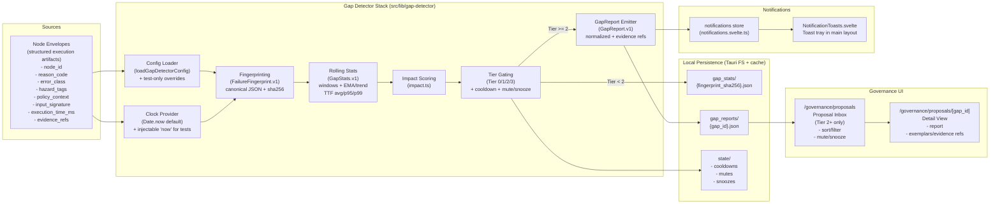

# Forge Ecosystem

## Documentation Contract

- **Repo type:** Ecosystem workspace root and cross-repository reference surface
- **Authority boundary:** Aggregates shared doctrine, integration rules, and operator entrypoints across Forge repositories; it does not replace repo-local system manuals
- **Git boundary:** Tracks only cross-cutting governance, tooling, protocol, and reference surfaces at the workspace root; nested subsystem repositories remain independent repos and are intentionally ignored here
- **Deep reference:** `doc/system/_index.md`, `doc/SYSTEM.md`, `docs/canonical/ecosystem_canonical.md`, `docs/canonical/documentation_protocol_v1.md`
- **README role:** Entry-point overview for operators and maintainers
- **Truth note:** Status lines, phase tables, counts, and implementation totals in this README are snapshot facts unless explicitly marked as canonical doctrine or target values

Unified AI infrastructure for the Forge product suite. This repository aggregates core services, shared infrastructure, and governance tooling.

This root git repository is not a monorepo wrapper around the subsystem implementations. It versions the ecosystem governance surface: canonical docs, protocol/registry files, CI support, cross-repo scripts, shared contracts, fixtures, tests, and monitoring/tooling that live at the workspace root. Service and application source remains owned by the nested repositories.

Canonical ecosystem documentation lives here:

* `docs/canonical/ecosystem_canonical.md`
* `docs/README.md` — Documentation hub
* `docs/DOCUMENTATION_INDEX.md` — Master documentation map

### Phase E — Publish / Release Gate (Contracts Only)

**Status:** 📐 Contract sketch (declarative), **Purpose:** Gate publishing with evidence, no execution.

Phase E consumes `VerificationAcceptance.v1` (decision=accept) plus read-only context (repo state, doctrine summary, evidence bundle, action classification) and produces advisory `ReleaseGateDecision.v1`, `ReleaseAffidavit.v1`, and a typed `PublishAuthorization.v1`. Nothing is deployed—Phase E only decides if publishing is allowed and records the final affidavit.

#### Phase E Inputs

* `PatchIntent.v1`, `VerificationPlan.v1`, `VerificationReport.v1`, and `VerificationAcceptance.v1` with `decision=accept` (missing acceptance blocks progression).
* Read-only context: repo identity/cleanliness, doctrine findings hash, evidence bundle/manifest hash/verified flag, action classification (`publish`, `deploy`, etc.).

#### Phase E Outputs

1. `ReleaseGateDecision.v1` – includes posture (repo clean, doctrine status, evidence readiness), stop-ship blockage reasons, decision (`allow | block`), constraints (`no_publish_performed`, human final gate required), and provenance; if any posture item is missing/failing the decision must be `block`.
2. `ReleaseAffidavit.v1` – recorded only when decision is `allow`; contains repo/commit, human intent + harm acknowledgment, doctrine summary + findings hash, evidence bundle id + manifest hash + `verified=true`, AI disclosure (models/roles), signer identity/authority/signature.
3. `PublishAuthorization.v1` – typed confirmation (`authorize | cancel`, `type_to_confirm`, rationale, authority level, human identifier, timestamp); missing authorization blocks release.

#### Phase E Stop-ship rules

Phase E must block if:

* repo clean state is unknown/dirty
* doctrine has BLOCK findings
* evidence bundle is missing or `verified !== true`
* verification acceptance is missing or not `accept`
* AI disclosure is absent when AI was used
* required authority level not met
* action lacks explicit publish authorization artifact

#### Phase E Non-capabilities

* Phase E must never tag, push, deploy, upload, mutate repos, infer AI disclosure, auto-allow waivers, or issue releases without typed confirmation.

#### Phase E Governance guarantees

* Decisions are immutable with reason codes.
* Waivers (if permitted) require Override authority and stay visible.
* Affidavit is the canonical final record; evidence must be hash-referenced.
* Missing proof → block.

Documenting Phase E (schemas, stop-ship rules, non-capabilities) completes the contract with zero runtime code.

---

### Governance Fixture Pack

`fixtures/phase-*` contains illustrative, non-executable examples that trace one governance flow from `GapReport.v1` through `ReleaseGateDecision.v1`. Each JSON includes consistent IDs/hashes and human rationales; they exist purely for review or tooling and do not imply execution.

---

## Overview

Forge is **internal AI engineering infrastructure**.

This repository defines the shared systems, services, and governance foundations that support the Forge product suite. It is not a consumer-facing application and is not versioned or released in the traditional sense.

Forge exists to make AI‑assisted systems **governable, auditable, and durable** over time.

Forge:SMITH also provides read-only governance tooling such as the Phase 1 repo import validator and runtime capability gating that keep desktop/Tauri flows predictable while protecting the broader ecosystem from unintended operations.

## Gap Detector — Internal Governance & Signal Layer

The Gap Detector is an internal governance and signal subsystem within the Forge ecosystem.

Its role is to observe structured execution artifacts (Node Envelopes), detect recurring capability gaps, and surface them through a governed human-review workflow. This system is designed to increase long-term ecosystem cohesion, power, and correctness — not as a public-facing feature or prototype.

The detector is deterministic, provenance-aware, and explicitly human-in-the-loop.



This layer intentionally favors determinism, auditability, and human authority over automation, and serves as a foundation for future governed capability expansion within Forge.

---

## Status

* **Operational State:** Active internal infrastructure
* **Maturity:** Early‑stable
* **Release Model:** Internal adoption only

---

## Services

| Service       | Role                                     | Port / Mode                  | Docs                           |
| ------------- | ---------------------------------------- | ---------------------------- | ------------------------------ |
| DataForge     | Vector memory and semantic search        | `8001`                       | `DataForge/README.md`          |
| NeuroForge    | LLM orchestration and routing            | `8000`                       | `NeuroForge/README.md`         |
| ForgeAgents   | Agent orchestration + EcosystemAgent     | `8010`                       | `ForgeAgents/README.md`        |
| Rake          | Data ingestion pipeline                  | `8002`                       | `rake/README.md`               |
| Forge Command | Desktop control plane                    | Desktop app + local control plane | `Forge_Command/README.md` |
| Forge:SMITH   | AI governance workbench                  | Desktop/Tauri + IPC          | `forge-smithy/README.md`       |
| Forge Eval    | Deterministic repository evaluation      | CLI / local repo execution   | `forge-eval/repo/README.md`    |
| Cortex BDS    | Local semantic file search               | Desktop/Tauri                | `cortex_bds/README.md`         |
| VibeForge     | Prompt engineering workbench             | App-specific runtime         | `Vibeforge_BDS/README.md`      |

---

## Infrastructure

| Service    | Purpose                              | Port |
| ---------- | ------------------------------------ | ---- |
| PostgreSQL | Shared telemetry database (pgvector) | 5432 |
| Redis      | Cache and sessions                   | 6379 |

---

## Usage

This repository is used by Forge operators and engineers to:

* Run and develop core Forge services
* Execute governance and verification workflows
* Maintain shared infrastructure and contracts

Entry points include Forge Command, CI pipelines, and service-level APIs.

### Markdown Plan Import (desktop only)

Forge:SMITH’s Planning form now accepts local Markdown plans so you can reuse existing documents instead of retyping them. Select any `.md`, `.markdown`, or `.txt` file and the desktop app normalizes its contents through the exact same planner normalizer you already use in the UI. Any warnings emitted by that normalizer show before the plan is scheduled, and only the canonical intent block is sent downstream—MAPO/MAID behaviors remain unchanged.

Imported plans are only supported in the Tauri shell: the control is disabled in browser/non-Tauri contexts, and the import service returns `TAURI_UNAVAILABLE` when the desktop bridge is absent.

Provenance metadata (filename, timestamp, content hash, and a redacted path by default) is stored in the planning request context so it can be audited without affecting plan semantics.

Basic workflow:

1. Open the Planning form inside Forge Command (desktop).
2. Click **Import Markdown Plan**.
3. Choose a Markdown/text file from your machine.
4. Review any normalizer warnings that appear.
5. Continue to start the planning session using the normalized description block.

---

## Development

Each service maintains its own development workflow and constraints.

Shared expectations:

* Governance checks are mandatory
* Evidence artifacts are first‑class outputs
* Service behavior must be inspectable and reproducible

### Language Standards (Ecosystem-Wide)

All code across the Forge ecosystem MUST follow these language standards:

| Language | Standard | Enforcement |
|----------|----------|-------------|
| **Svelte** | Svelte 5 Runes only (no Svelte 4 patterns) | `svelte-check`, CI gates |
| **Rust** | Rust 2024 Edition (`edition = "2024"`) | `cargo clippy`, CI gates |
| **Python** | Python 3.11+, type hints, Pydantic v2 | `ruff`, `mypy`, CI gates |

**Svelte 5 Runes (Required):**

* Use `$props()`, `$state()`, `$derived()`, `$effect()`
* Use `Snippet` type with `{@render}` (not `<slot />`)
* Use callback props like `onSave?: () => void` (not `createEventDispatcher`)
* Use `onclick={handler}` (not `on:click={handler}`)

See individual service READMEs for details.

### Local Development Setup

For local development, you need to run the core services and configure environment variables.

#### Start Core Services

```bash
# Terminal 1: DataForge (port 8001)
cd DataForge && source venv/bin/activate && uvicorn app.main:app --port 8001

# Terminal 2: NeuroForge (port 8000)
cd NeuroForge && source venv/bin/activate && uvicorn app.main:app --port 8000

# Terminal 3: ForgeAgents (port 8010)
cd ForgeAgents && source venv/bin/activate && uvicorn app.main:app --port 8010

# Terminal 4: ForgeCommand Orchestrator (port 8003)
cd Forge_Command/orchestrator && source venv/bin/activate && uvicorn app.main:app --port 8003

# Terminal 5: Rake (port 8002) - optional
cd rake && source venv/bin/activate && uvicorn app.main:app --port 8002
```

#### Configure Environment Variables

Create `.env` files from `.env.example` in each service with local URLs:

| Service      | Variable                     | Local Value               |
| ------------ | ---------------------------- | ------------------------- |
| ForgeAgents  | `DATAFORGE_URL`              | `http://localhost:8001`   |
| ForgeAgents  | `NEUROFORGE_URL`             | `http://localhost:8000`   |
| ForgeAgents  | `FORGECOMMAND_URL`           | `http://127.0.0.1:8003`   |
| forge-smithy | `FORGEAGENTS_URL`            | `http://127.0.0.1:8010`   |
| forge-smithy | `VITE_FORGE_AGENTS_BASE_URL` | `http://127.0.0.1:8010`   |
| forge-smithy | `VITE_DATAFORGE_BASE_URL`    | `http://localhost:8001`   |

#### Production Defaults

Services default to production URLs (Render deployments) except ForgeCommand which is local-only:

| Service                   | Production URL                          |
| ------------------------- | --------------------------------------- |
| DataForge                 | `https://dataforge-pzmo.onrender.com`   |
| NeuroForge                | `https://neuroforge-9lxc.onrender.com`  |
| ForgeAgents               | `https://forgeagents.onrender.com`      |
| Rake                      | `https://rake-zp35.onrender.com`        |
| ForgeCommand Orchestrator | `http://127.0.0.1:8003` (local only)    |

#### Local Resident Interfaces

| Service                   | Port | Purpose                        |
| ------------------------- | ---- | ------------------------------ |
| NeuroForge                | 8000 | LLM orchestration              |
| DataForge                 | 8001 | Vector storage, persistence    |
| Rake                      | 8002 | Data ingestion                 |
| ForgeAgents               | 8010 | Agent orchestration, BDS layer |
| ForgeCommand Orchestrator | 8003 | Run lifecycle, token issuance  |
| ForgeCommand API          | 8004 | Local API boundary             |

Desktop/Tauri apps and CLI subsystems do not publish resident service ports in the canonical local topology.

---

## Operations

Operational behavior is driven by:

* Ecosystem verification (health, readiness, synthetics)
* Doctrine validation in CI and local workflows
* Immutable evidence written to disk

Operational reference:

* `docs/canonical/FORGE_SYSTEMS_MANUAL.md`

---

## Governance

Forge governance is implemented as infrastructure, not policy documents.

Key components:

* Doctrine Validator: `docs/plans/archive/doctrine/DOCTRINE_QUICK_START.md`
* Full doctrine implementation: `docs/plans/archive/doctrine/DOCTRINE_VALIDATION_IMPLEMENTATION.md`
* Verification schemas and contracts: `docs/contracts/`
* Audit reports: `docs/audits/`

Governance outputs are evidence files. User interfaces are read‑only views.

### Phase B — Proposal Bundle Builder (Contracts Only)

**Status:** 📐 Designed (declarative), **Authority:** Human-reviewed, non-executable.

This node consumes `GapReport.v1` reports at **Tier ≥ 2** (cooldown `eligible`, no synthetic/test-only reports) and emits `ProposalBundle.v1` artifacts. It never mutates repositories, never emits patches, and never calls downstream nodes. Multiple proposals are intentional: Node B frames options, humans decide.

#### Phase B Contract highlights

* `ProposalBundle.v1` is advisory-only and immutable once emitted.
* Each bundle includes classification, a proposal set, topology reasoning (DOT-only), constraints (no auto-apply, human review required), and provenance metadata.
* `topology_diff_dot` is strictly a read-only Graphviz hint showing affected nodes and wiring; it carries no execution semantics.
* Regeneration requires a new `GapReport.v1`; no bundle may be updated in place.

#### Phase B Non-capabilities

* No code generation, no patch emission, no repo writes.
* No Node C invocation, no authorization inference, no automatic "best" selection.
* Humans retain full decision authority—Node B merely packages the evidence flowing from Node A.

### Phase C — Patch Proposal Intake (Contracts Only)

**Status:** 📐 Contract sketch (declarative), **Purpose:** Record authorization, emit intent.

Phase C consumes a human-approved `ProposalBundle.v1` (Tier ≥ 2, eligible cooldown, bundle hash unchanged) plus a human decision envelope and emits a `PatchIntent.v1` that freezes *what* was approved. No code, no diffs, no side effects. Decisions of `defer` or `reject` produce no intent artifact.

#### Phase C Inputs

* `ProposalBundle.v1` – read-only, unsigned, unchanged.
* Human decision payload:

```json
{
  "decision": "approve | defer | reject",
  "selected_proposal_ids": ["uuid"],
  "rationale": "...",
  "constraints": { "no_auto_apply": true, "requires_verification": true },
  "decided_by": "...",
  "decided_at": "ISO-8601"
}
```

#### Phase C Output – `PatchIntent.v1`

```json
{
  "_schema": "PatchIntent.v1",
  "intent_id": "uuid",
  "source_bundle_id": "uuid",
  "approved_proposals": ["uuid"],
  "scope": {
    "repos": ["forge-smith"],
    "components": ["executor"],
    "change_type": "code | config | threshold | infra"
  },
  "constraints": {
    "no_auto_execute": true,
    "verification_required": true,
    "rollback_required": true
  },
  "authority": {
    "approved_by": "human identifier",
    "approval_timestamp": "ISO-8601",
    "approval_hash": "sha256"
  },
  "provenance": {
    "bundle_hash": "sha256",
    "gap_hash": "sha256",
    "phase_c_version": "semver"
  }
}
```

#### Phase C Non-capabilities

* Phase C must never generate patches, touch repositories, invoke CI/CD, infer implementation details, bypass humans, or trigger Phase D.
* `PatchIntent.v1` is intent, not action; downstream nodes may only act after explicit downstream approval.

#### Phase C Governance guarantees

* Intents are immutable and recorded per approval event.
* Revocation requires a new intent.
* Downstream phases may only read intents emitted by Phase C.

Documenting this closes Phase C: schema written, authority policy stated, no runtime code required.

### Phase D — Verification Gate (Contracts Only)

**Status:** 📐 Contract sketch (declarative), **Purpose:** Define verification requirements and record outcomes without execution.

Phase D consumes a human-approved `PatchIntent.v1` (with verification required, authority metadata present) plus a read-only verification context and emits advisory `VerificationPlan.v1` and `VerificationReport.v1` artifacts, followed by a human-signed `VerificationAcceptance.v1`. Nothing executes; Phase D only spells out what must be proven and records the results.

#### Phase D Inputs

* `PatchIntent.v1` – must include `authority.approved_by`, `provenance.bundle_hash`, `gap_hash`, and `constraints.verification_required === true`.
* Verification context (repo identities, baseline tests, doctrine version, environment declaration), supplied read-only.

#### Phase D Outputs

1. `VerificationPlan.v1` – checklist with scope, requirements (`req_id`, category, description, pass criteria, mandatory flag, evidence artifact spec), waiver gates, and provenance.
2. `VerificationReport.v1` – immutable record of execution context, per-requirement results (`pass | fail | skipped | waived`) with evidence hash references, summary counts, waivers metadata, constraints, and provenance.
3. `VerificationAcceptance.v1` – human decision (`accept | reject`) with rationale, authority level, and timestamp; missing acceptance keeps downstream blocked.

#### Phase D Non-capabilities

* Phase D must never execute commands, run tests, apply patches, mutate repos, auto-approve waivers, infer passes without hashed evidence, or trigger Phase E.

#### Phase D Governance guarantees

* All artifacts are immutable; evidence is referenced by hash.
* Mandatory fails produce overall `fail` or `blocked`.
* Waivers stay visible and require explicit authority.
* Acceptance is a separate artifact; absence means blocked.

Documenting Phase D (schemas, non-capabilities, human gate) completes the contract with zero runtime code.

---

## References

* `docs/canonical/ecosystem_canonical.md` — Ecosystem canonical doctrine
* `docs/canonical/FORGE_SYSTEMS_MANUAL.md` — Complete systems manual
* `docs/architecture/forge_ecosystem_single_page_security_diagram.md` — Security architecture
* `docs/README.md` — Full documentation index

---

Maintained by **Boswell Digital Solutions LLC**.
