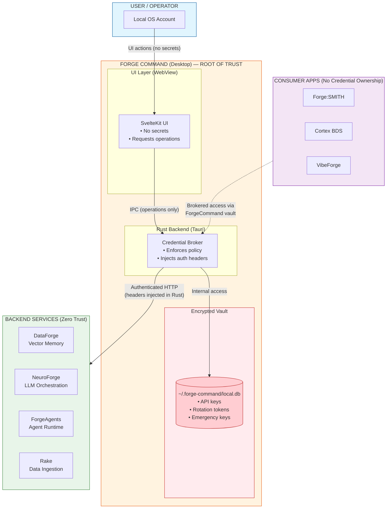
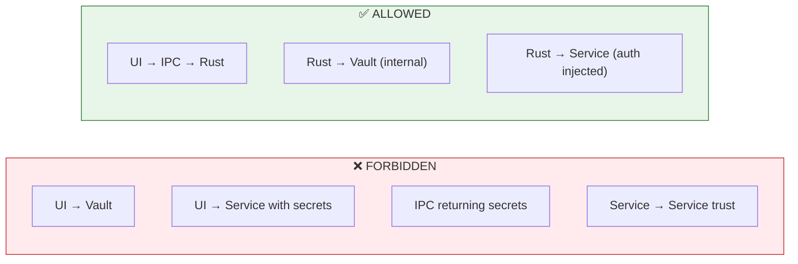
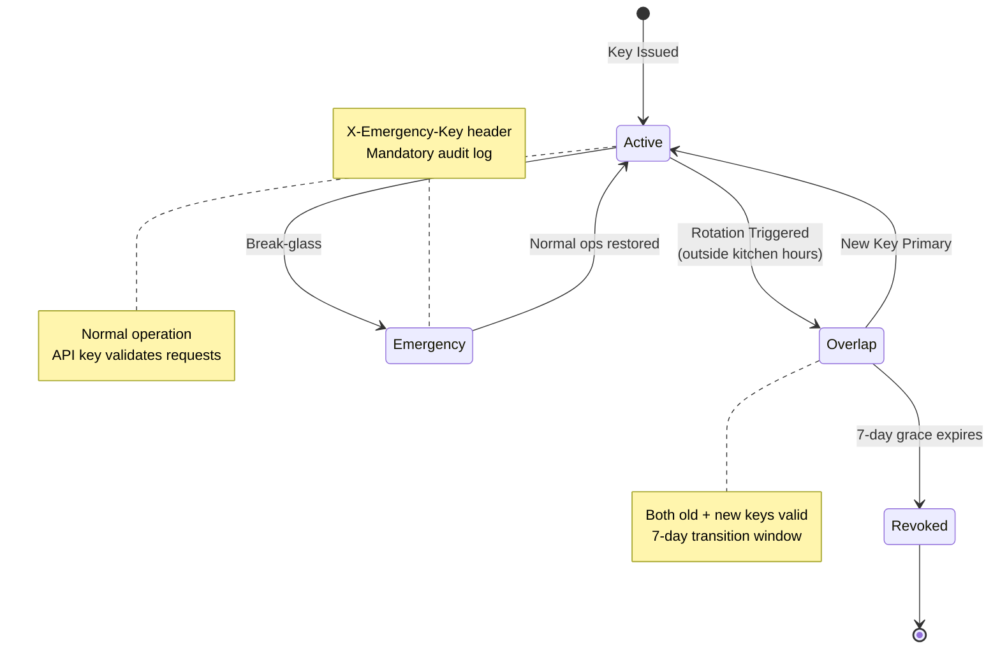

# Forge Ecosystem — Single-Page Security Diagram

<!-- CANONICAL SECURITY DIAGRAM OF RECORD -->
<!-- Any architecture change must be reflected here -->
<!-- Last verified: 2025-12-27 -->

> **Purpose:** Provide a one-page, authoritative visual model of credential authority, trust boundaries, and enforcement rules across the Forge Ecosystem.
>
> **Audience:** Internal developers, auditors, future contributors, investors (technical).
>
> **Normative Reference:** `SECURITY.md`

---

## Security Architecture (Mermaid)



## Trust Boundary Flow



## Credential Lifecycle



---

## High-Level Security Topology (ASCII Reference)

<details>
<summary>Click to expand ASCII diagram</summary>

```
┌──────────────────────────────────────────────────────────────────────────┐
│                              USER / OPERATOR                              │
│                       (Local OS Account, Desktop Trust)                    │
└──────────────────────────────────────────────────────────────────────────┘
                                      │
                                      │ UI Actions (No Secrets)
                                      ▼
┌──────────────────────────────────────────────────────────────────────────┐
│                           FORGE COMMAND (DESKTOP)                          │
│                         🔐 ROOT OF TRUST / AUTHORITY                        │
│                                                                            │
│  ┌──────────────────────────────┐      ┌──────────────────────────────┐   │
│  │   SvelteKit UI (WebView)     │─────▶│   Rust Backend (Tauri)        │   │
│  │   • No secrets               │ IPC  │   • Credential broker         │   │
│  │   • Requests operations      │      │   • Enforces policy           │   │
│  └──────────────────────────────┘      └───────────────┬──────────────┘   │
│                                                          │                 │
│                                                          │ Internal Only   │
│                                                          ▼                 │
│                                         ┌──────────────────────────────┐   │
│                                         │  Encrypted SQLite Vault       │   │
│                                         │  ~/.forge-command/local.db    │   │
│                                         │  • API keys                   │   │
│                                         │  • Rotation tokens            │   │
│                                         │  • Emergency keys             │   │
│                                         └──────────────────────────────┘   │
│                                                                            │
└──────────────────────────────────────────────────────────────────────────┘
                                      │
                                      │ Authenticated HTTP (Headers Injected)
                                      ▼
┌──────────────────────────────────────────────────────────────────────────┐
│                         FORGE BACKEND SERVICES (ZERO TRUST)                │
│                                                                            │
│  ┌──────────────┐  ┌──────────────┐  ┌──────────────┐  ┌──────────────┐   │
│  │ DataForge    │  │ NeuroForge   │  │ ForgeAgents  │  │ Rake         │   │
│  │              │  │              │  │              │  │              │   │
│  │ • API Key    │  │ • API Key    │  │ • API Key    │  │ • API Key    │   │
│  │ • Admin Key  │  │ • Admin Key  │  │ • Admin Key  │  │ • Admin Key  │   │
│  │ • Emergency  │  │ • Emergency  │  │ • Emergency  │  │ • Emergency  │   │
│  └──────────────┘  └──────────────┘  └──────────────┘  └──────────────┘   │
│                                                                            │
│   Rules Enforced Per Request:                                               │
│   • Validate active API key                                                 │
│   • Respect rotation overlap                                                │
│   • Enforce kitchen hours                                                   │
│   • Audit all security events                                               │
│                                                                            │
└──────────────────────────────────────────────────────────────────────────┘
```

</details>

---

## Trust Boundary Summary

```
[ USER ]
   ↓ (no secrets)
[ UI LAYER ]                ❌ Secrets forbidden
   ↓ IPC (operations only)
[ RUST BACKEND ]            ✅ Trusted executor
   ↓ internal access only
[ VAULT ]                   🔐 Secrets live here
   ↓ authenticated HTTP
[ SERVICES ]                🔒 Zero-trust, verify every request
```

**Key Rule:**
> Secrets move **downward only**, never upward.

---

## Credential Classes & Scope

| Credential Type | Lives Where | Used By | Scope |
|-----------------|-------------|---------|-------|
| Service API Key | ForgeCommand Vault | Rust backend | Normal operations |
| Rotation Admin Token | Service env + vault | ForgeCommand | Key issuance only |
| Emergency Ops Key | Service env + vault | Humans / ForgeCommand | Break-glass |

---

## Explicitly Forbidden Paths

```
❌ UI → Vault
❌ UI → Service (with secrets)
❌ Service → Service trust
❌ IPC returning secrets
❌ Secrets in .env (post-ForgeCommand)
```

If a data flow resembles any of the above, it is **invalid by design**.

---

## Rotation & Emergency Overlay

```
Normal Operation
└─ API Key → Service

Scheduled Rotation (Outside Kitchen Hours)
└─ ForgeCommand → Admin Endpoint → New Key
   └─ 7-Day Overlap → Old Key Revoked

Emergency
└─ X-Emergency-Key → Immediate Access
   └─ Mandatory Audit Log
```

---

## Non-Negotiable Invariant

> **Deleting any UI application must not compromise credentials or service access.**

If removing Forge:SMITH, Cortex, or VibeForge breaks authentication, the security model has been violated.

---

## Canonical References

- `SECURITY.md` — Normative security policy
- Forge Ecosystem Systems Manual — Implementation detail
- Security Alignment Verification — Audit confirmation

---

**Boswell Digital Solutions LLC**  
_“Trust is not granted. It is enforced.”_