# V1 System Boundaries and Artifact Flows

Date: 2026-04-22
Time: 2026-04-23 00:36 UTC

## Purpose

This document focuses on **what artifact crosses each boundary**, not just which system talks to which system.

## Top-level boundary diagram

```mermaid
flowchart LR
    subgraph E1[Evidence Producers]
        A1[Centipede]
        A2[Registry]
        A3[Other Evidence Sources]
    end

    subgraph T1[Truth Core]
        B1[DoppelCore]
    end

    subgraph P1[Correction Fabric]
        C1[forgeHQ]
        C2[ForgeMath]
        C3[forge-eval]
        C4[eval-cal-node]
    end

    subgraph S1[Operator Governance]
        D1[Self-Healing]
    end

    subgraph X1[Execution Lanes]
        E2[FA-Local-Operator]
        E3[ForgeAgents]
    end

    subgraph F1[Feedback and Reconciliation]
        G1[Execution Receipts]
        G2[Post-Change Verification]
        G3[Registry / DoppelCore / Self-Healing Updates]
    end

    E1 -->|Findings, evidence, mismatch observations| T1
    T1 -->|Correction-ready truth artifacts| P1
    P1 -->|Evaluated proposal packets| S1
    S1 -->|Approved execution packets| X1
    X1 -->|Receipts and post-change evidence| F1
    F1 -->|Status refresh, truth update, re-crawl trigger| E1
```

## Boundary-by-boundary artifact map

| From | To | Artifact(s) crossing the boundary | Why it exists |
|---|---|---|---|
| Centipede / Registry / other evidence sources | DoppelCore | Findings, mismatch observations, evidence references, run provenance, trace payloads | Raw governed input for truth normalization |
| DoppelCore | forgeHQ | Correction opportunities, drift records, target identity, lineage bundle | Workflow-ready remediation intake |
| DoppelCore | ForgeMath | Severity vectors, weighting inputs, confidence inputs, mismatch class | Scoring and prioritization |
| DoppelCore | forge-eval | Proof obligations, evaluation packet, acceptance criteria, target state | Candidate correction evaluation |
| DoppelCore | eval-cal-node | Calibration packet, thresholds, benchmark comparison inputs | Evaluator stability |
| forgeHQ stack | Self-Healing | Proposal packet, evaluation result, priority, confidence, lineage, approval posture | Operator-facing remediation object |
| Self-Healing | FA-Local-Operator | Approved local execution packet, bounded patch/action payload, policy context | Local correction execution |
| Self-Healing | ForgeAgents | Approved cloud execution packet, bounded patch/action payload, policy context | Cloud correction execution |
| FA-Local-Operator / ForgeAgents | Registry / DoppelCore / Self-Healing | Execution receipt, stdout/stderr summary, result state, post-change evidence, rollback evidence | Close the loop and refresh posture |
| Feedback systems | Centipede | Re-crawl trigger, target refresh request, verification target list | Re-check truth after mutation |

## Artifact families to keep explicit

### Evidence-producing artifacts
- findings
- mismatch observations
- evidence bundles
- contradiction bundles
- negative evidence
- run provenance
- revision anchors

### Truth-core artifacts
- twin truth records
- drift records
- correction opportunities
- proof obligations
- evaluation packets
- lineage bundles

### Proposal and approval artifacts
- proposal packets
- evaluation results
- approval posture
- bounded execution packets

### Feedback artifacts
- execution receipts
- rollback receipts
- post-change verification bundles
- re-crawl requests
- truth refresh requests

## Boundary rule

No system should receive only a vague status when a richer governed artifact is required.

That means:

- Registry should not receive only "a run happened"
- Self-Healing should not receive only "there is a finding"
- execution lanes should not receive only "please fix this"

Every handoff should carry the artifact needed for the **next authority boundary**.
