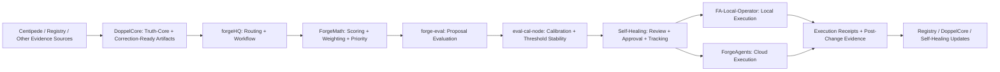
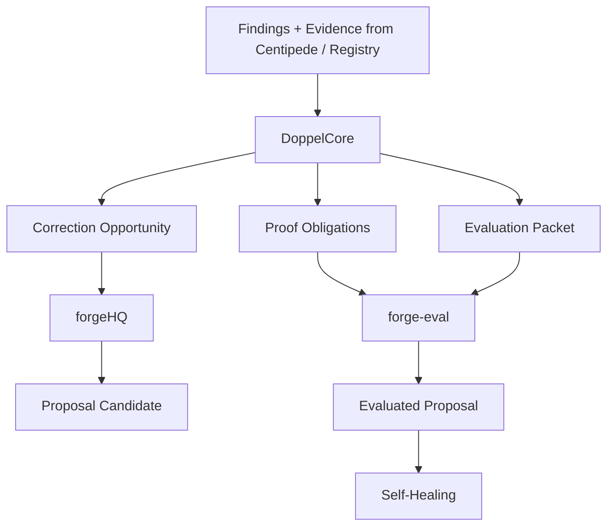

# V1 Correction Fabric Process Diagrams

Date: 2026-04-22
Time: 2026-04-23 00:36 UTC

## Purpose

This document gives a Mermaid-safe view of the correction flow so the stack can be reviewed visually.

## 1. Full correction loop



## 2. Evidence-to-proposal path



## 3. Approval-to-execution split

```mermaid
flowchart TD
    A["Self-Healing Approved Proposal"] --> BExecution Domain
    B -->|Local| C["FA-Local-Operator"]
    B -->|Cloud| D["ForgeAgents"]
    C --> E["Local Execution Receipt"]
    D --> F["Cloud Execution Receipt"]
    E --> G["Post-Change Verification"]
    F --> G
    G --> H["DoppelCore / Registry / Self-Healing Refresh"]
```

## 4. Why the split matters

### Centipede is upstream evidence
Centipede should stop at:
- finding
- evidence
- contradiction preservation
- projection emission

### DoppelCore is truth and correction-readiness
DoppelCore should stop at:
- truth normalization
- mismatch formalization
- proof obligations
- correction-ready packets

### Correction fabric is proposal work
The correction-fabric stack should:
- route
- score
- evaluate
- calibrate

### Self-Healing is governance
Self-Healing should:
- review
- approve
- track
- hold posture
- hand off approved execution packets

### Execution lanes mutate state
Execution lanes should:
- execute bounded actions
- produce receipts
- feed verification back upstream
